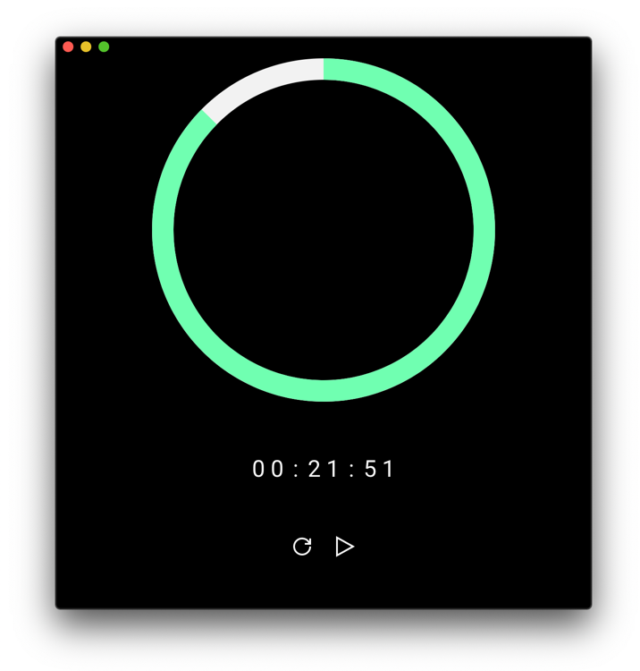

# expanse

💻 A desktop app that helps you avoid repetitive strain injuries

- Feel let’s stressed and more mindful with regular breaks
- Prevent repetitive strain injuries with gentle stretches you can do at your desk
- Finish work without feeling tired and achy

  

## Status

The app is not ready yet. There is still a lot to do. You can see everything that needs to be done [under the Projects tab](https://github.com/matt-allan/expanse/projects/1). Contributions welcome!
